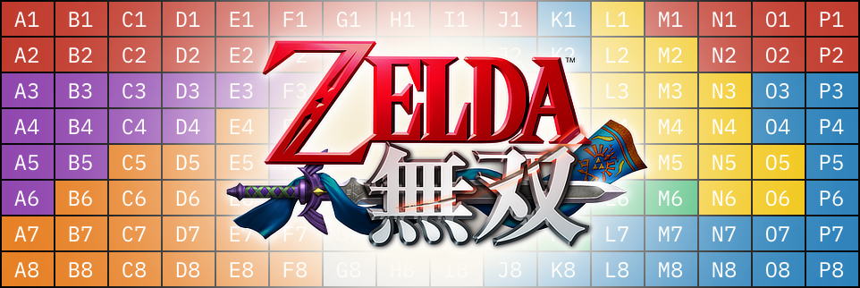

= Hyrule Warriors Interactive Maps
MetroWind <chris.corsair@gmail.com>

Use `map-gen` to generate `maps.html` using the data in `maps.xml`.
The data file `maps.xml` is generated with `grab.py`, (Don’t look
at it. It’s ugly,) which downloads
https://gamefaqs.gamespot.com/community/SBAllen[SBAllen]’s
https://gamefaqs.gamespot.com/3ds/167257-hyrule-warriors-legends/faqs/73095/[unlockables
guide], and “parses” the HTML.
